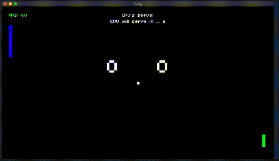
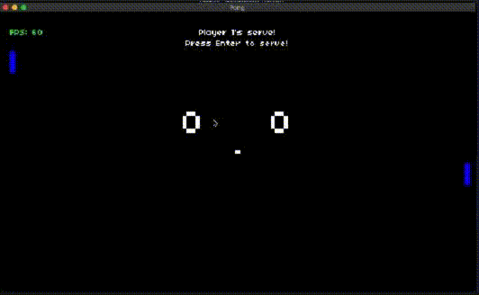
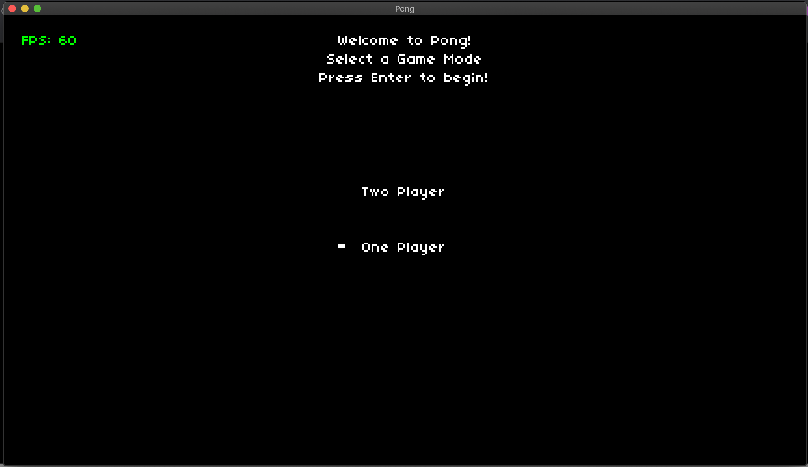

# Pong - In Lua 

Made modifications to the classic game pong - All work was done in a Love2D framework that was based off of an initial repository found at https://github.com/games50/pong

The new features are listed below with accompanying screenshots:
* Three difficulty options within single player mode (Easy, Hard, Almost Impossible)

Easy Mode 

Almost Impossible Mode

* Color customization of players paddles 

* A loading screen that allows you to choose between game modes (Single Player and Two Player)

Notes for installation/running on MacOS -> 
* Download the most recent version of Love2D at https://love2d.org/#download
* Place download in Application folder 
* Clone repository 
* Drag repository over Love2D application to load game
