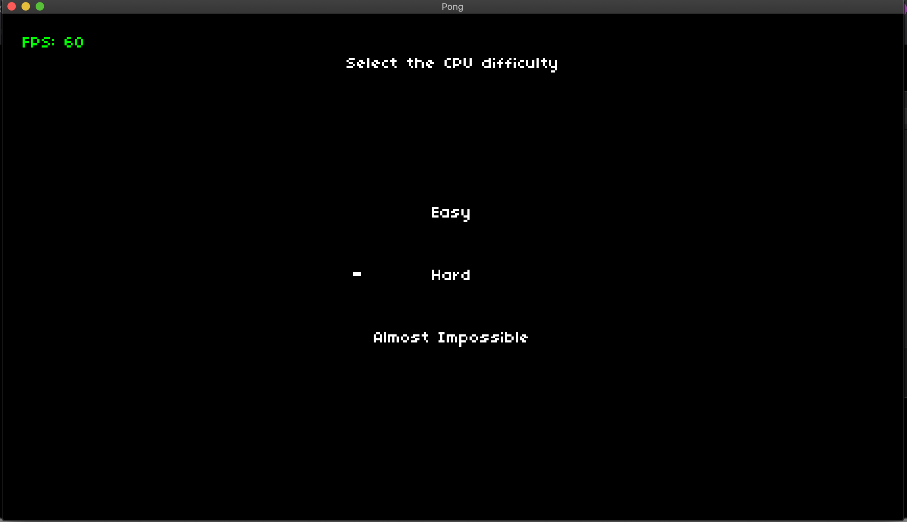
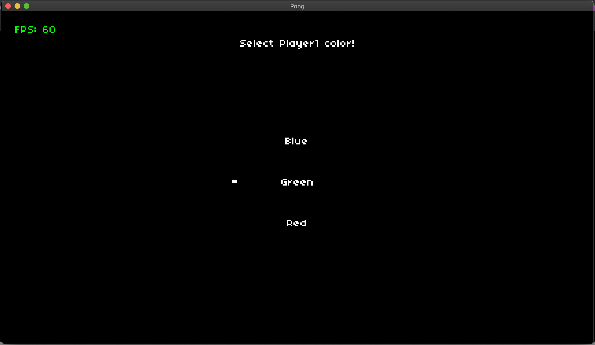
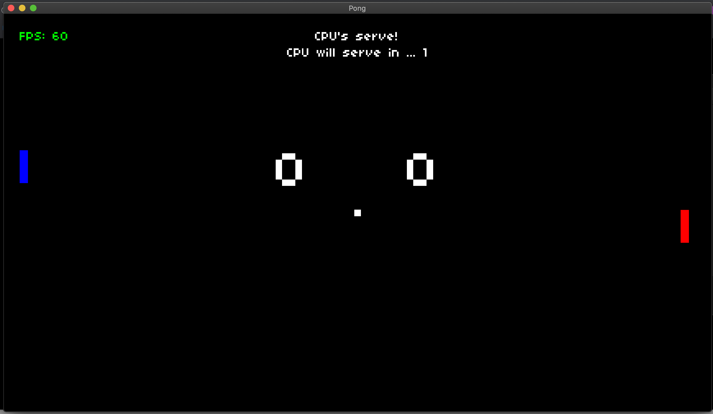

# Pong - In Lua 

Made modifications to the classic game pong - All work was done in a Love2D framework that was based off of an initial repository found at https://github.com/games50/pong

The new features are listed below with accompanying screenshots:
* A loading screen that allows you to choose between game modes (Single Player and Two Player)

* Three difficulty options within single player mode (Easy, Hard, Almost Impossible)

* Color customization of players paddles 

Resulting in gameplay like this!

Notes for installation/running -> 
Will require the installation of love2D
